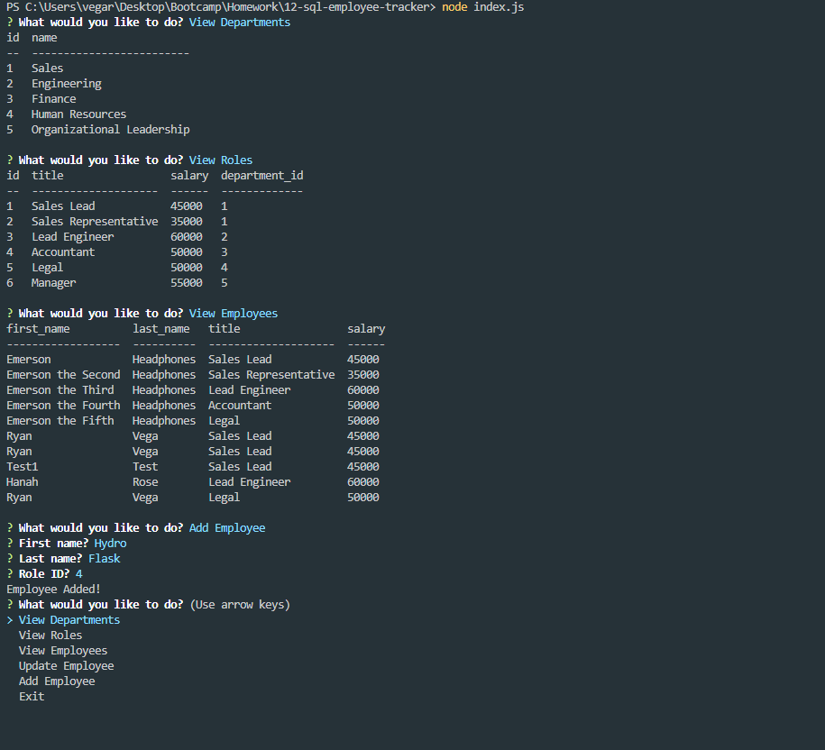
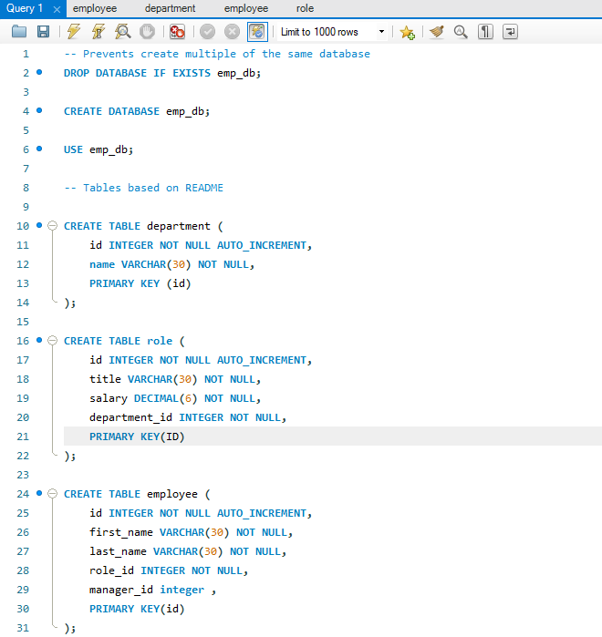

# Employee Tracker
## Description

I created an employee tracker using inquirer js, MySql, and Console.Table. Inquirer JS allows us to prompt actions from users and connects the data from MySql to be populated. MySql allows me to Create, Read, Update, and Delete data entered from users. Console.Table beautified our command line interface results when requesting for certain information. With this application, users are able to view employees, roles, and departments. Then they may add more users to it

Image of Project in Action

Image of Database

## Installation

You can pull the files I used via github, then all you need is to install all the dependencies with "npm i" in the commnad line interface.

## Usage 

To use this tool, you need to use the Command Line Interface and type in "node index.js" this will prompt the questions for users to answer. Once all the questions are completed it will take you through a series of options to manipulate the data in the MySql databas.

## Future

I would like to incorporate more features into this project. I want to be able to add and remove departments, managers. I want to be able to remove employees. I want to be able to update employees.

I feel as though I am close to accomplishing these future tasks, but do not currently have time to sink into it.

## Contributors / Links

Ryan Vega

https://github.com/vegaryanneil/12-sql-employee-tracker

